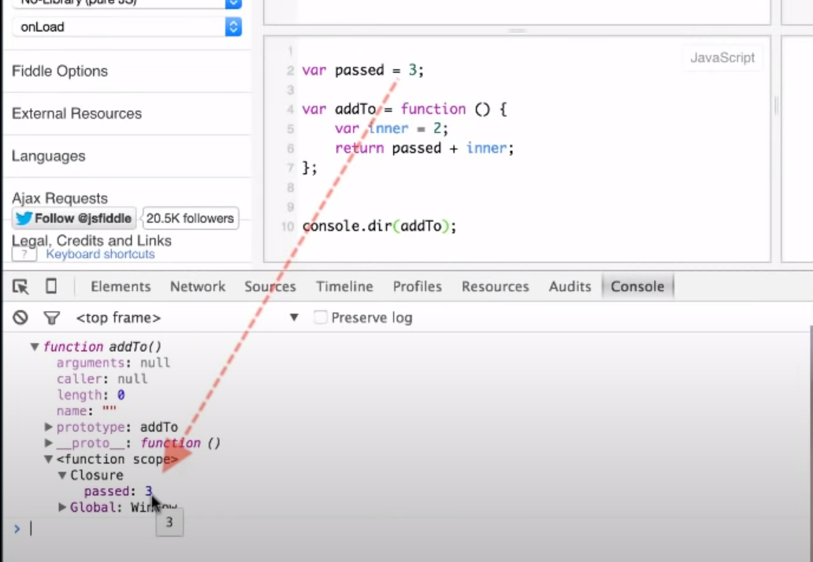
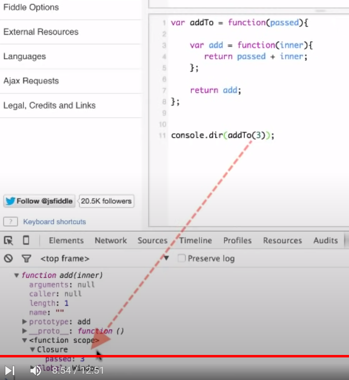
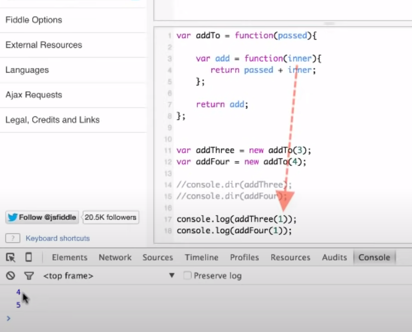

Worth Watching video of all times for closure: [Video by Techsith](https://www.youtube.com/watch?v=71AtaJpJHw0&t=1s)

Some more References:
- [Stale closures in React hooks](https://dmitripavlutin.com/react-hooks-stale-closures/)
- [Basic closure by dmitri](https://dmitripavlutin.com/simple-explanation-of-javascript-closures/)

### What is scope?
The scope is a `space policy` that rules the `accessibility of variables`.
When you define a variable, you want it to exist within some boundaries may be function block or some code block

# Closures
Inshort 1: Any function, that access variables outside of its scope is a closure

Inshort 2: A function inside a function creates a closure

Inshort 3: Closures are nothing but FUNCTIONS WITH PRESERVED DATA

Let' take some simple Example 1: With single function
```javascript
var passed = 3;

var addTo = function(){
  var  inner = 2;
  return inner + passed;
}
```
The above function addTo will create the closure. But How?

addTo function is trying to access the passed variable which is defined outside the function scope(which is in lexical scope). 
Behind the scenes when we call addTo function it will create the function scope with closure inside it preserving the data for variables which is not declared inside the function.

If we don't have varibles defined in function scope but trying to read the variable then it will look into the parent scope and up until it founds the value of it.
If it's not defined anywhere, then the variable will be treated as undefined



Simple Example 2: Function inside a function 
```javascript
var addTo = function(passed){

    var  add = function(inner){
      return inner + passed; // reading the value of passed from lexical scope
    }

    return add;     
}
```




++++++++++++++++++++++++++++++++++++++++++++
### More Examples for Closure
Capturing variables from the lexical scope is useful in callbacks.

Examples include: all the iterators `ex: forEach, etc`, callBack(), setTimeout() callback,concept of Currying and many more

A setTimeout() is a callback
```javascript
const message = 'Hello, World!';
setTimeout(function callback() {
  console.log(message); // logs "Hello, World!"
}, 1000);
```
Using Foreach iterator

```javascript
let countEven = 0;
const items = [1, 5, 100, 10];
items.forEach(function iterator(number) {
  if (number % 2 === 0) {
    countEven++;
  }
});
console.log(countEven); // => 2
```
Currying
```javascript
function multiply(a) {
  return function executeMultiply(b) {
    return a * b;
  }
}
const double = multiply(2);
double(3); // => 6
double(5); // => 10
const triple = multiply(3);
triple(4); // => 12
```
multiply is a curried function that returns another function.

Currying, an important concept of functional programming, is also possible by the closures.

executeMultiply(b) is a closure that captures a from its lexical scope. When the closure is invoked, the captured variable a and the parameter b are used to calculate a * b.
